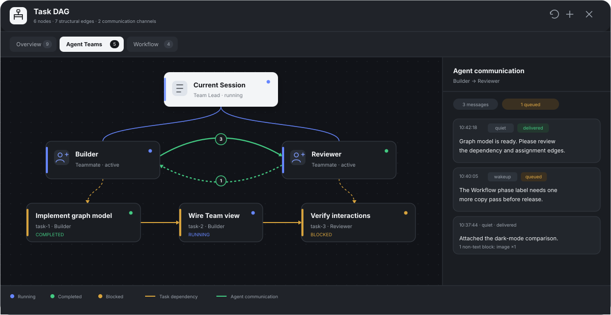
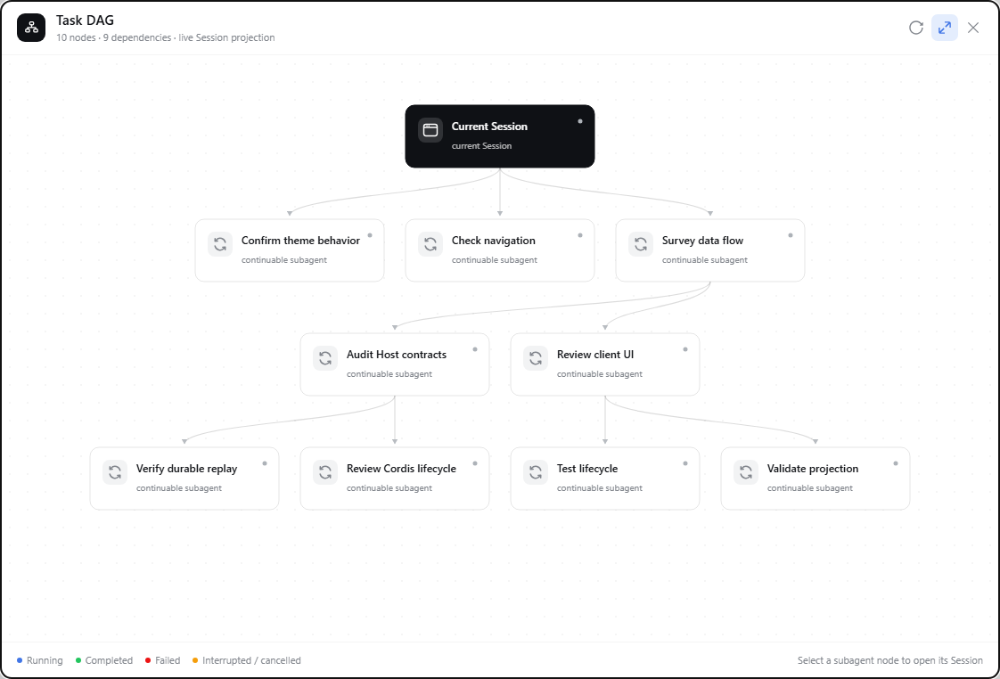
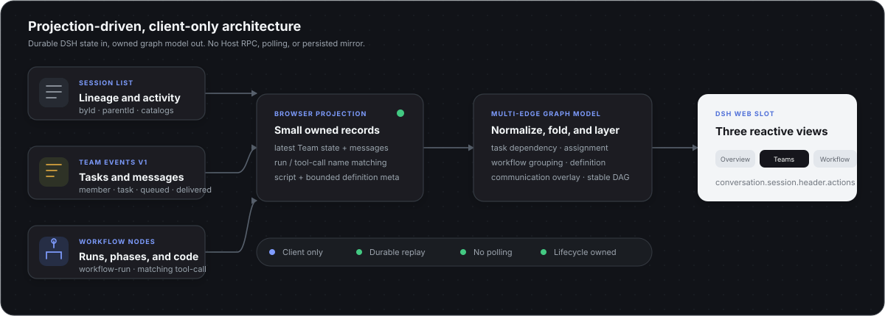

<h1 align="center">dsh-task-dag</h1>

<p align="center">
  A persistent, live task topology for DeepSeek Harness Web.<br>
  See Sessions, delegated subagents, and durable workflows as one navigable DAG.
</p>

<p align="center">
  <a href="https://awesome.re"></a>
  <a href="https://awesome-dsh-plugin.com"></a>
  <a href="https://github.com/LeemanCheung/dsh-task-dag/actions/workflows/ci.yml"></a>
  <a href="https://github.com/LeemanCheung/dsh-task-dag/releases/latest"></a>
  <a href="LICENSE"></a>
</p>

<p align="center">
  English · <a href="README.zh.md">中文</a>
</p>



## At a glance

`dsh-task-dag` turns DSH's existing Client projections into a top-to-bottom dependency graph. It keeps no parallel workflow database and sends no polling requests: when Session state changes, the graph changes with it.

| Capability | Behavior |
| --- | --- |
| Live topology | Reacts to Session and subagent catalog snapshots without Host polling. |
| Durable workflows | Reconstructs workflow phases and members from `workflow-run` Conversation Nodes after restart. |
| Clear ownership | Groups workflow members under workflow nodes instead of drawing duplicate root-to-child edges. |
| Direct navigation | Opens healthy, list-visible subagent Sessions from their graph nodes. |
| Native presentation | Uses DSH theme semantics, restrained status colors, and custom SVG icons in light and dark modes. |
| Lifecycle safe | Registers UI and styles through Cordis lifecycle ownership and removes them on unload. |

## Live screenshot

Captured from a running DSH Web Session with task labels anonymized. The panel, layout, edges, controls, and status presentation are the actual plugin UI.



## Install

```powershell
dsh plugin --profile web add github:LeemanCheung/dsh-task-dag
```

Restart the current DSH Web process once after the first installation, then refresh the page. The **Task DAG** action appears in the Session header.

For a version-pinned installation:

```powershell
dsh plugin --profile web add github:LeemanCheung/dsh-task-dag#v1.1.0
```

## Using the graph

| Action | Result |
| --- | --- |
| Select **Task DAG** | Opens the Session-scoped graph panel. |
| Select a subagent node | Opens that Session when it is available in the Session list. |
| Toggle fit mode | Switches between a whole-graph overview and the original scrollable canvas. |
| Refresh | Refreshes observed subagent catalogs; workflow nodes remain projection-driven. |
| Drag the title bar | Repositions the panel without capturing toolbar controls. |
| Press `Escape` or select close | Closes the panel and restores focus to the trigger. |

Status colors are deliberately limited to business blue, success green, error red, and warning amber. All other hierarchy is expressed through spacing, typography, borders, and line styles.

## Architecture



The browser plugin combines three durable Client-facing sources:

- `SessionListState.byId` and `parentId` provide subagent lineage.
- `SessionListState.subagentsByParent` provides labels, modes, activity, and catalog health.
- `workflow-run` Conversation Nodes provide workflow phases, members, and outcomes.

The owned graph model then normalizes lineage, inserts workflow grouping nodes, derives navigation capability, lays out stable vertical layers, and renders into `conversation.session.header.actions`.

There is no process-local workflow cache, model prompt contribution, model tool, Host RPC endpoint, or polling loop.

## Security and permissions

This is a browser-only, read-only visualization plugin. It does not read workspace files, execute commands, open network connections, register model tools, or persist Session content and credentials.

See [SECURITY.md](SECURITY.md) for the reporting policy and complete trust boundaries. Private vulnerability reporting is enabled for the repository.

## Development

Requirements: Node.js 20 or newer.

```bash
npm install
npm run check
```

The check pipeline:

1. validates source syntax;
2. rebuilds the precompiled browser module;
3. validates the generated bundle syntax;
4. runs jsdom interaction smoke tests for workflow grouping, fit mode, close controls, and node navigation;
5. verifies in CI that committed `lib/client.js` is reproducible from source.

## Remove

```powershell
dsh plugin --profile web remove dsh-task-dag
```

## License

[MIT](LICENSE) © LeemanCheung
